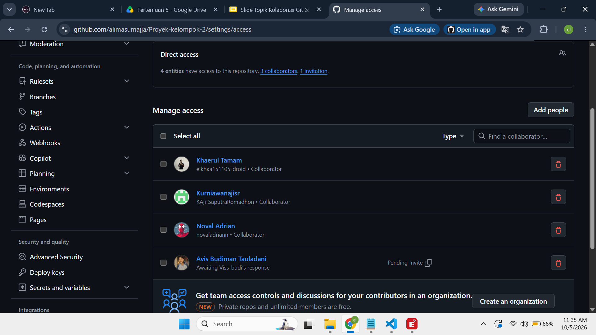
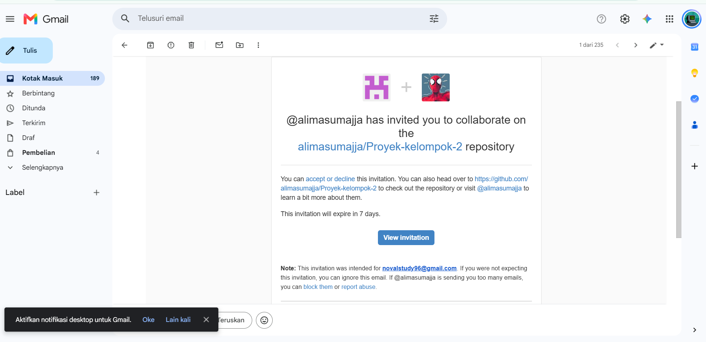
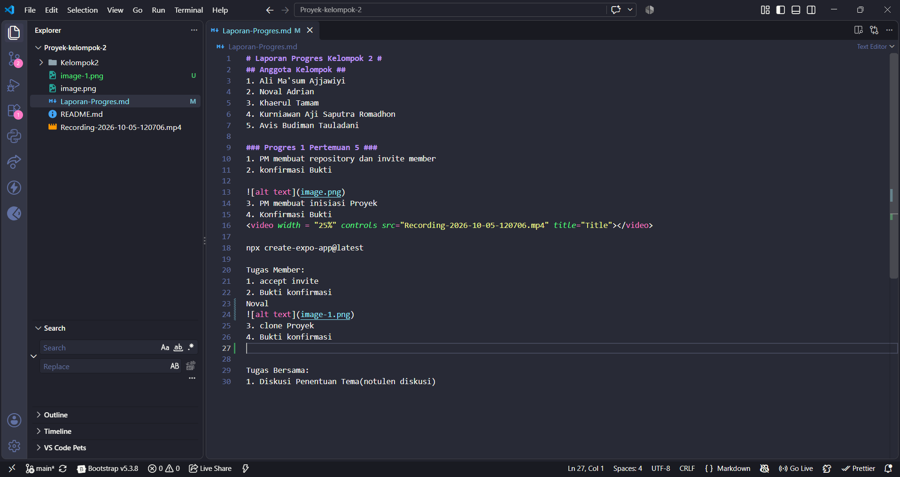
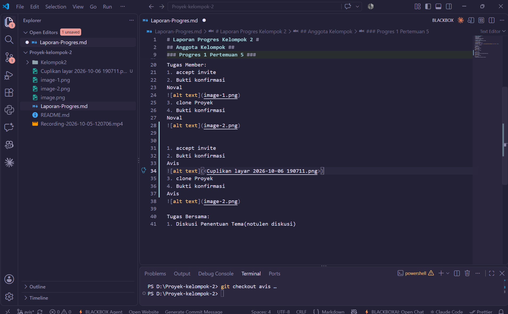
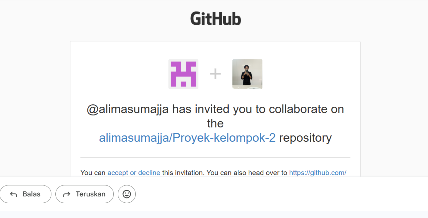
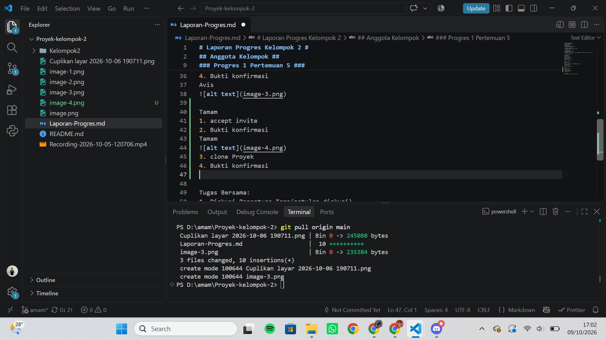

# Laporan Progres Kelompok 2 #
## Anggota Kelompok ##
1. Ali Ma'sum Ajjawiyi
2. Noval Adrian
3. Khaerul Tamam
4. Kurniawan Aji Saputra Romadhon
5. Avis Budiman Tauladani

### Progres 1 Pertemuan 5 ###
1. PM membuat repository dan invite member
2. konfirmasi Bukti

3. PM membuat inisiasi Proyek
4. Konfirmasi Bukti
<video width = "25%" controls src="Recording-2026-10-05-120706.mp4" title="Title"></video>

npx create-expo-app@latest

Tugas Member:
1. accept invite
2. Bukti konfirmasi
Noval

3. clone Proyek
4. Bukti konfirmasi
Noval

Avis
1. accept invite
2. Bukti konfirmasi
Avis

3. clone Proyek
4. Bukti konfirmasi
Avis

Tamam
1. accept invite
2. Bukti konfirmasi
Tamam

3. clone Proyek
4. Bukti konfirmasi

Tugas Bersama:
1. Diskusi Penentuan Tema(notulen diskusi)